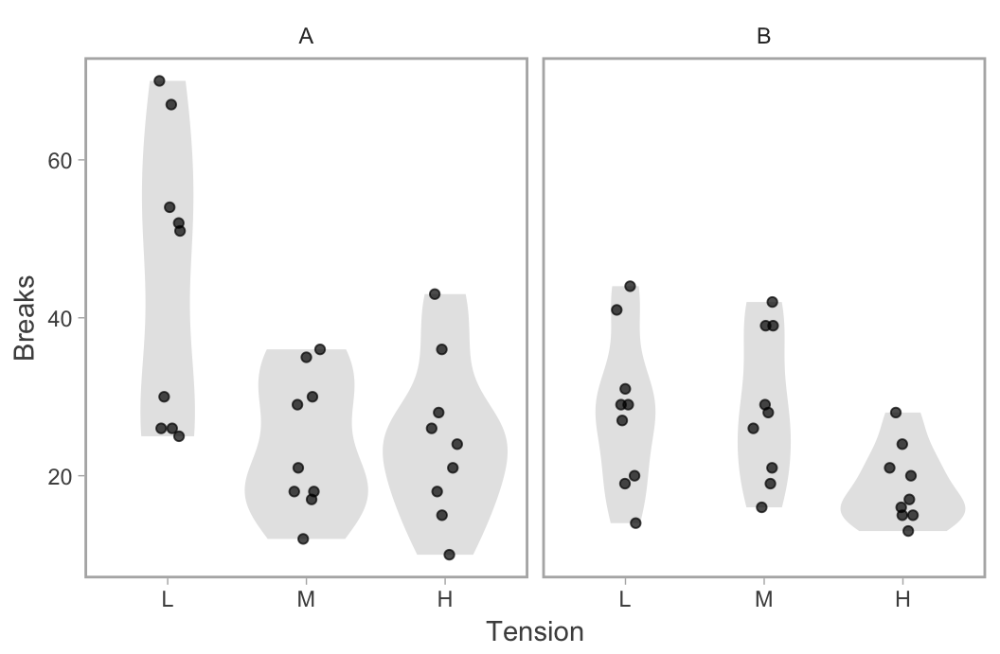

<!-- README.md is generated from README.Rmd. Please edit that file -->
ggsidekick
==========

Contains a simple theme for ggplot2, `theme_sleek()`, that loosely resembles nicely themed plots (to my taste) from R base graphics. The theme builds on `ggplot2::theme_light()`. I may add more ggplot helper functions in the future.

Installing:

``` r
# install.packages("devtools")
devtools::install_github("seananderson/ggsidekick")
```

Exciting demo with dataset showing the number of breaks in yarn during weaving for 2 yarn types and 3 tension levels:

``` r
library(ggsidekick)
library(ggplot2)
ggplot(warpbreaks, aes(tension, breaks)) + 
  geom_violin(fill = "grey90", col = NA) +
  geom_jitter(width = 0.1, height = 0, alpha = 0.7) +
  facet_wrap(~wool) + labs(x = "Tension", y = "Breaks") +
  theme_sleek() # ggsidekick magic happens here
```


